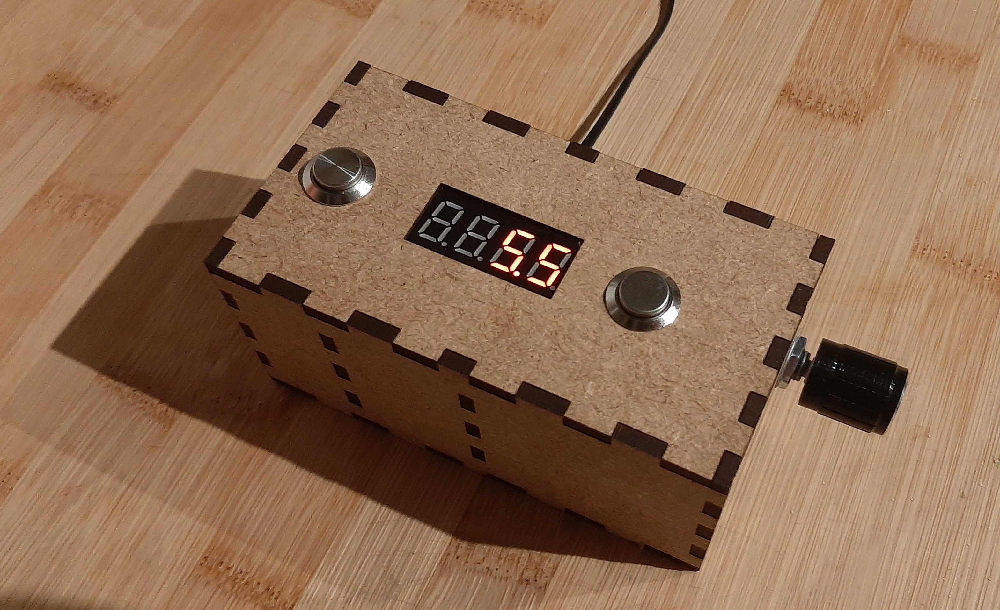
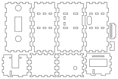

# Enlarger Timer
This is a timer for a darkroom enlarger to accurately control exposure time of analog prints.

The timer consists of two parts: a _switch_ and a _remote_.

## Switch
The switch is reprogrammed Sonoff BASICR2. 
It hosts a Wi-Fi network and an HTTP server that provides a simple API to turn the enlarger on, off, turn it on for a specific number of milliseconds or to simply request the current state. 
It also provides a small website through which all features can be accessed for debugging purposes. 

## Remote

The remote is powered by an esp8266 and features two buttons, a red four digit seven-segment LED display and a rotary encoder. 
The encoder can be used to set the time in 0.5 second steps or 0.1 second steps after pressing the integrated button. 
By turning the encoder below zero, the enlarger is turned permanently, so the print can be prepared. 

The right button turns the enlarger on for the selected time while the remaining time is shown on the display. 
The left button starts a 30 seconds timer without turning on the enlarger. 
Repeated button presses add 30 seconds to the remaining time. 
This feature is useful for controlling development and fixing times. 

Both timer modes, with or without enlarger can be cancelled by pressing the right button. 

The electronics are housed in a case made out of laser cut 3 millimeter thick MDF. 
The case was designed using Inkscape and is fully assembled using friction fits, such that no glue is required. 

